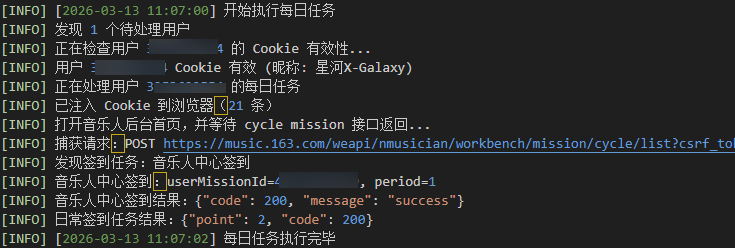
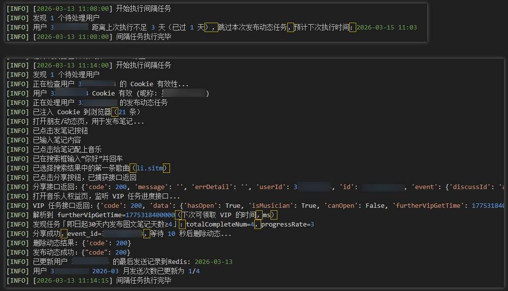
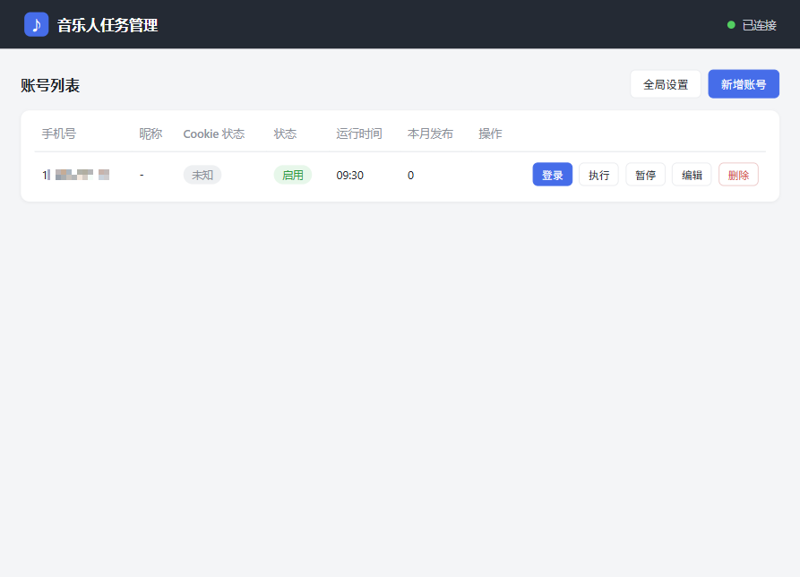
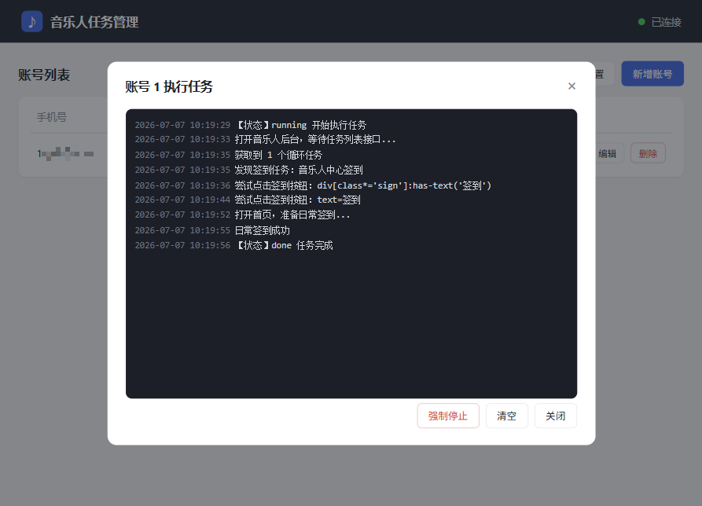
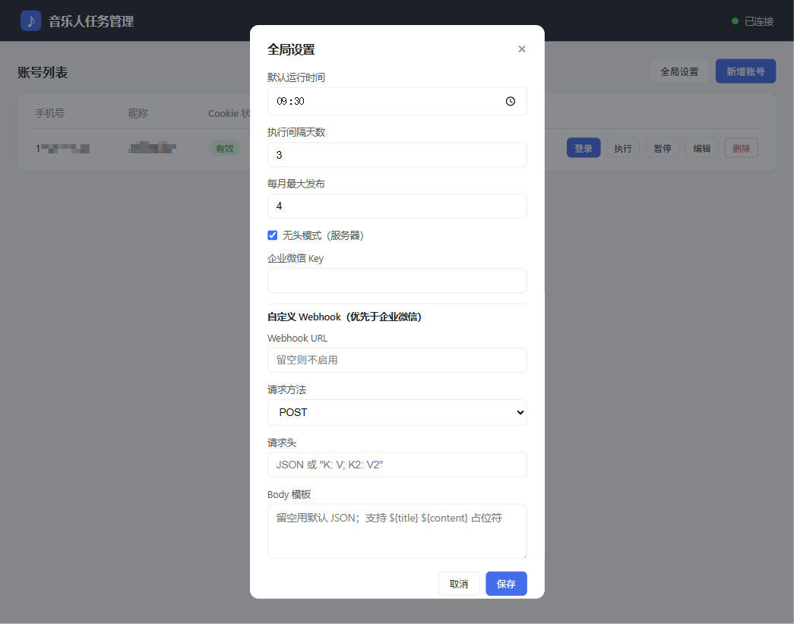
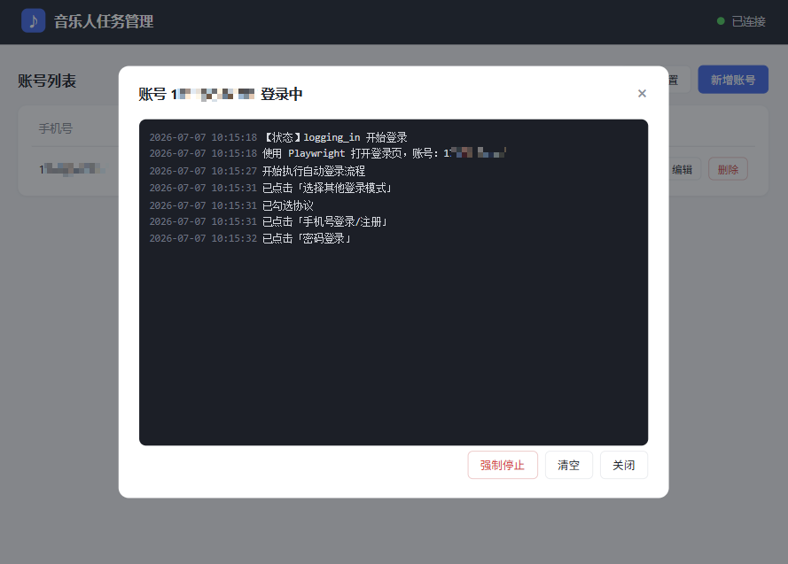
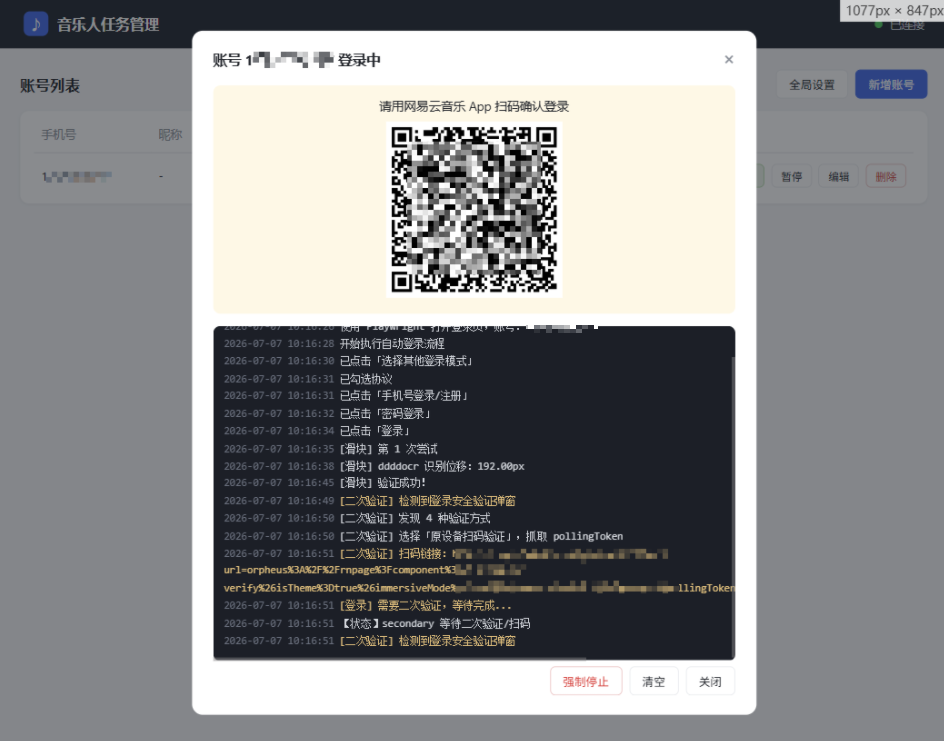
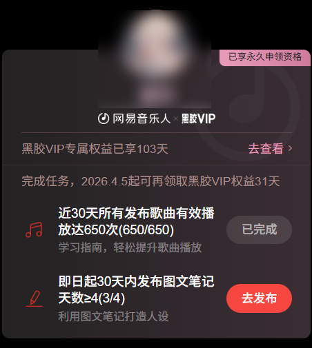
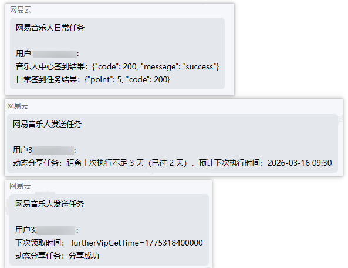

## 功能预览（Feature Preview）

> 本文是对项目核心能力的图文预览，更适合快速了解「这个工具能帮我做什么」。
> 2.0 起为**完全浏览器自动化 + Web 管理界面**，以下截图部分来自早期版本，仅示意任务效果。

### 1. 核心自动化能力（全程浏览器）

- **每日签到自动化**
  - 自动完成「音乐人云豆签到」与日常签到
  - 全程浏览器同源操作，规避 `301 用户未登陆` 风控
  - 按运行时间每天定时执行，无需人工干预

- **音乐人动态分享自动化**
  - 自动配乐发布笔记，约 10 秒后自动删除，不打扰好友
  - 按间隔天数控制发布频率，受每月上限约束

### 2. Web 管理界面

- **可视化账号管理**：网页端增删改账号，无需手动操作数据库
- **一键执行**：单个「执行」按钮多选任务（签到 / 发布动态 / VIP 领取）
- **实时日志**：登录与任务过程通过 WebSocket 实时显示在弹窗，运行中按钮变「查看」可回看累积日志
- **强制停止**：抢占式单浏览器，可随时手动强制停止
- **移动端自适应**：手机访问自动切换卡片式布局

### 3. 可视化登录与风控优化

- **Web 可视化登录**：填手机号 + 密码后台启动浏览器登录，进度实时显示
- **易盾滑块自动识别**：ddddocr + OpenCV 计算缺口，模拟人类轨迹拖动
- **二次验证扫码**：登录安全验证的扫码二维码直接显示在网页上，同时可推送到通知渠道
- **登录态复用**：每账号独立持久化 profile，已登录则跳过密码登录

### 4. VIP 权益与附加任务

- **VIP 自动领取**
  - VIP 可领取日自动打开权益页领取
  - 自动解析下次可领取时间并记录

### 5. 通知与可观测性

- **Webhook 通知**
  - 支持自定义 Webhook（优先）与企业微信机器人（兜底）
  - 推送扫码提醒与任务执行结果，适合服务器无人值守运行

- **日志与调试**
  - 实时日志推送 + 文件日志（`app/data/log/app.log`）
  - 登录异常/风控自动截图存档到 `app/data/debug/{手机号}/`

### 6. 部署体验

- **Docker 一键运行**：`docker compose up -d --build`，访问 `http://localhost:8000`
- **数据持久化**：SQLite / 浏览器 profile / 日志 / 截图统一在 `app/data`，挂载即持久化
- **本地 / 服务器通用**：`uvicorn app.main:app` 本地调试（可开有头浏览器）或服务器长期运行（无头）

---

如需更详细的参数说明与配置，请查看主文档 [README.md](../README.md)。
